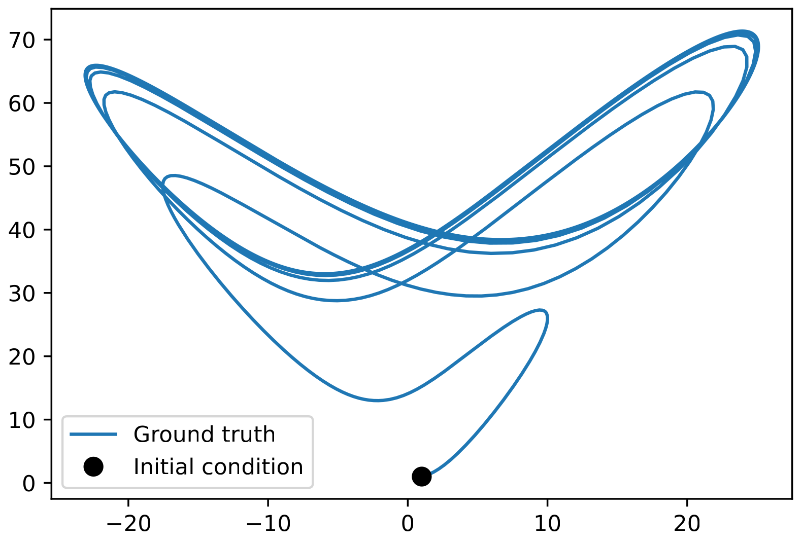
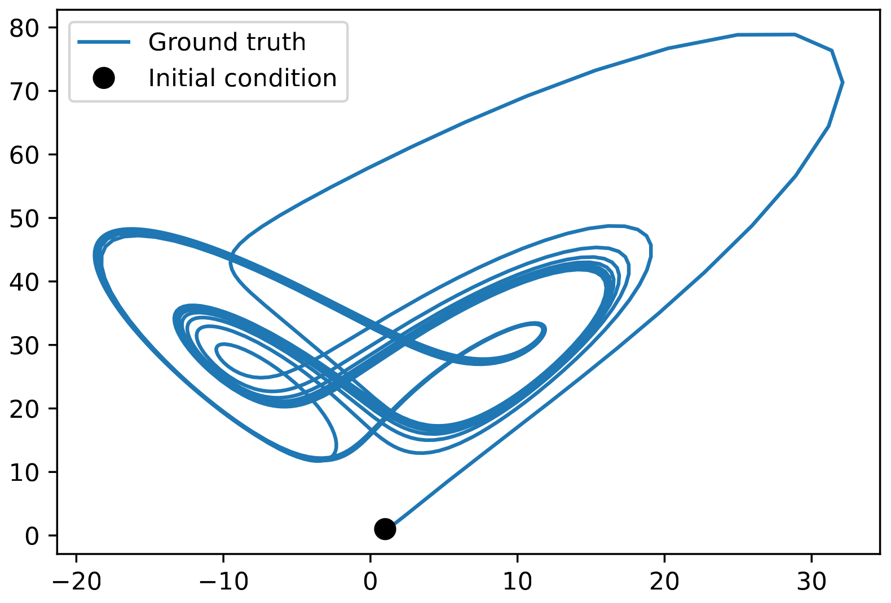
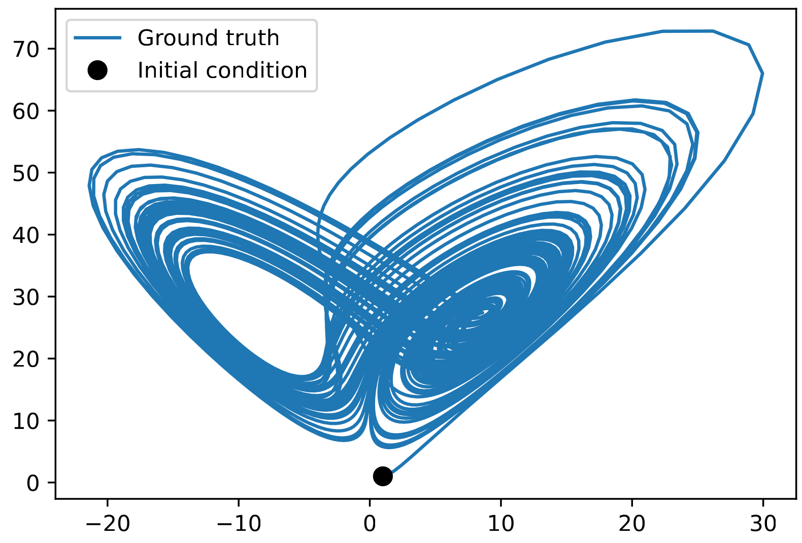
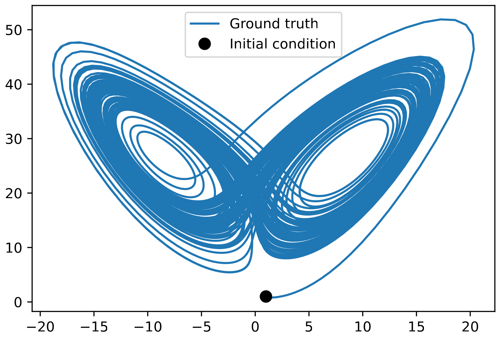
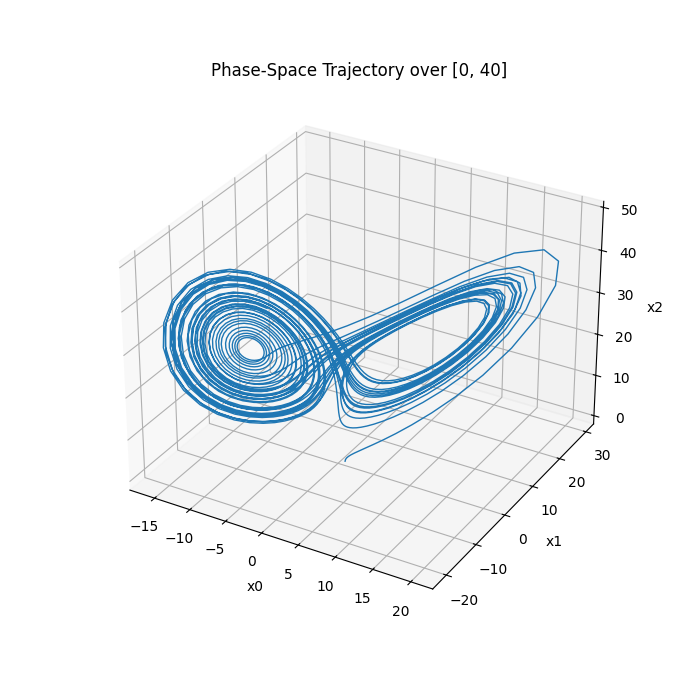
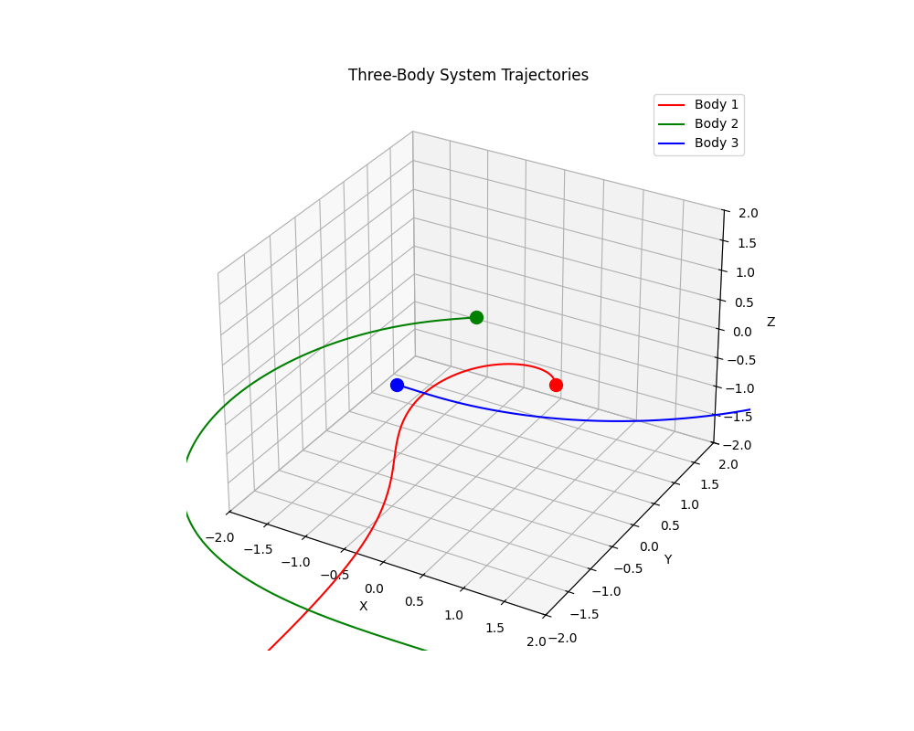
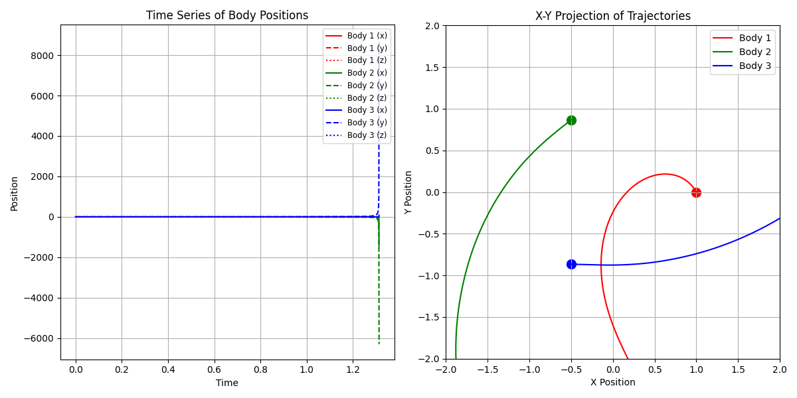

# Mechanistic Neural Networks for Scientific Machine Learning

*Mechanistic Neural Networks for Scientific Machine Learning*, Adeel Pervez, Francesco Locatello, Efstratios Gavves, *International Conference on Machine Learning (ICML) 2024*. \[[Arxiv](https://arxiv.org/abs/2402.13077)\]

# Reproduction results

## Lorenz

I ran the code for the Lorenz system mulltiple times with different epoch numbers to see how quickly and precise the model approximates the differential equation.

### Results 
- 10 epochs



- 50 epochs



- 75 epochs



- 400 epochs



I also wrote code to visualise the resulting differential equation (400 epochs) curve in 3D (phase space)


And, of course, a cool animation


This is the differential equation produced by the 400 epochs run:
```
dx/dt = -8.4991*x + 8.9277*y - 0.0025*x² + 0.0021*x*y - 0.0358*x*z + 0.0227*y*z

dy/dt = 1.0575 + 20.0465*x + 4.2891*y - 0.0547*z + 0.0154*x² - 0.0108*x*y - 0.7631*x*z - 0.1551*y*z

dz/dt = 0.6265 + 0.0052*x - 0.0149*y - 2.6752*z + 0.0070*x² + 0.9449*x*y + 0.0414*y²
```
The result is very close to the actual Lorenz system with `rho = 28, sigma = 10.0, beta = 8.0 / 3.0` (parameters used to create the dataset)

## Three-body problem (reproduction extension)

[I also extended the examples to support discovering a three-body problem differential equation approximation.](/home/study/Desktop/Work/mech-nn/visualise/visualise_three_body.py) 

Trained on 400 epochs, here is a visualisation of resulted differential equation (and some plots):





And an animation showing the dynamics:


The discovered equations for the three-body system are significantly more complex than the Lorenz system due to the increased dimensionality (9 spatial dimensions) and the complex gravitational interactions between the bodies.

# Initital README

## Paper Abstract
This paper presents *Mechanistic Neural Networks*, a neural network design for machine learning applications in the sciences. It incorporates a new *Mechanistic Block* in standard architectures to explicitly learn governing differential equations as representations, revealing the underlying dynamics of data and enhancing interpretability and efficiency in data modeling.
Central to our approach is a novel *Relaxed Linear Programming Solver* (NeuRLP) inspired by a technique that reduces solving linear ODEs to solving linear programs. This integrates well with neural networks and surpasses the limitations of traditional ODE solvers enabling scalable GPU parallel processing.
Overall, Mechanistic Neural Networks demonstrate their versatility for scientific machine learning applications, adeptly managing tasks from equation discovery to dynamic systems modeling. We prove their comprehensive capabilities in analyzing and interpreting complex scientific data across various applications, showing significant performance against specialized state-of-the-art methods.

## Running Experiments
To run the code create a conda environment by using the env.yml file.
Small test examples can be run in the given Jupyter Notebooks.
These include a simple fitting test of a damped sinusoidal wave, a solver comparison with scipy odeint, and 2-body trajectory predictions.

The test examples were run with the dense Cholesky solver. Set the Cholesky solver in config.py


### Discovery

**Lorenz**. For the Lorenz system ODE discovery run

```
PYTHONPATH=. python discovery/lorenz.py
```
or 

```
PYTHONPATH=. python discovery/lorenz_ind.py
```
for an example with a flat parameter vector without an NN.

Plots and logs are saved in the `logs` directory. 

The discovery proceeds in a cycle of optimization and thresholding the basis weights.
The optimization runs for 400 epochs, which is a safe value but takes some time. A smaller value could possibly work.

Generated trajectory from a learned equation.


**Logistic**. Generates a set of noisy trajectories from the logisitc ODE, each with different parameters. During inference the model outputs parameters for a given trajectory.

Run

```
PYTHONPATH=. python discovery/logistic.py
```

The following plot shows learned logistic parameters for 100 trajectories:


### PDE
Generate 1D KdV data using the scripts at https://github.com/brandstetter-johannes/LPSDA
Modify the data location in pde/kdv.py if needed.
Edit config.py and set the Cholesky solver.

Run using
```
PYTHONPATH=. python pde/kdv.py
```

After training test rmse can be calculated by using the `losses` function in kdv.py. Pass the Pytorch checkpoint.

The following figures show a ground truth trajectory (left) and the corresponding prediction (right)


### N-body ephemerides

Get data using the astroquery script in the nbody directory.
Edit the data_ephermris.py file to set the data path if needed.
Set the conjugate gradient solver.

Run using
```
PYTHONPATH=. python pde/ephemeris_sys.py
```

Test trajectories can be generated using generate function by passing a checkpoint.
